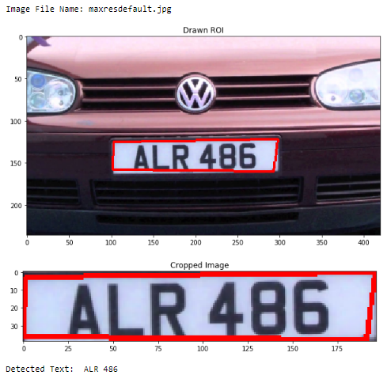

# Vehicle Number Plate Detection Using OpenCV and Tesseract
Note: All images used are used from web.
## Steps
* Install OpenCV.
* Install PyTesseract and Tesseract.
    * Make sure tesseract is recognized as environment variable.
    * [Read official docs](https://github.com/tesseract-ocr/tesseract).

## Demo

## Workflow
* Read Image
* Convert to Grayscale.
* Denoise it using Bilateral Filter!
* Edge detection using Canny Edge Detector.
* Contour Extraction.
* Mask Generation.
* ROI Generation.
* Passing to Tesseract.
* Show it!
* Done!
