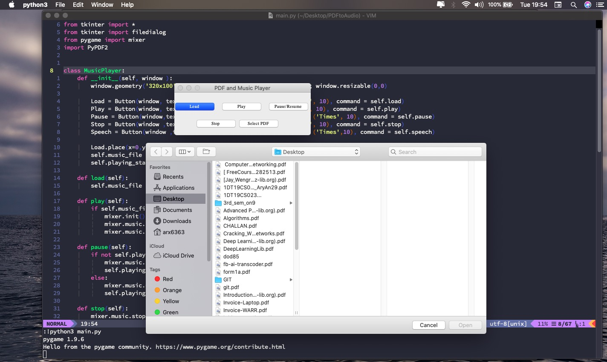

# PDF to Audio Converter and a Music Player:

Steps for Installation:

1. In your shell run `pip install -r requirements.txt`.
2. Then `python3 main.py`

How to use:

* When converting PDF to Audio

1. Click on `Select PDF`
2. Select a PDF file.
3. Depending on the size of PDF, it takes time to make an audio file for it, have patience.
4. It uses Google Text to Speech Service.
5. When ready you can click on `Load`. (Audio file is saved in same folder, where PDF is)
6. Now click on `Play`.

* When using as a music player

Repeat steps 5 and 6 of the above.
This is quick and small solution.

The reason I kept UI small, to make it more usable and adjustable.

