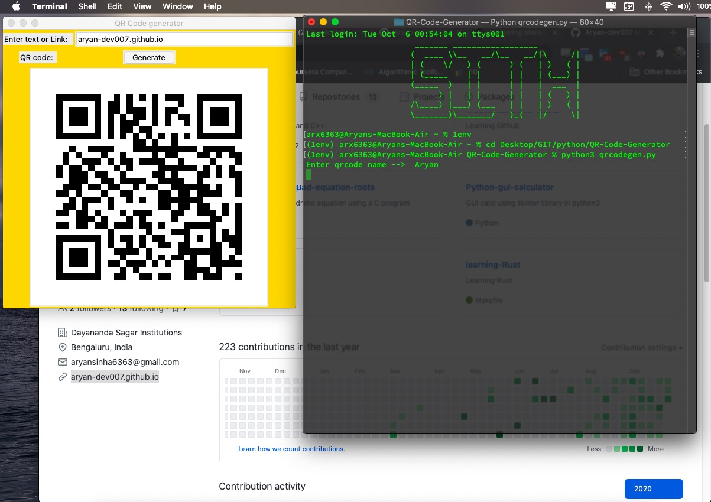

# You need to follow these steps before using :

1. In your shell do `pip install -r requirements.txt` 

2. Goto Line 15 in "qrcodegen.py" and change save_path variable to
as per your preference. 
save_path is location where you're qrcode will be saved. 

3. Then do `python3 qrcodegen.py`

4. Once you execute above command a window will pop-up and then you can enter your link or text.

5. You can find your image in location you specified in save_path.

