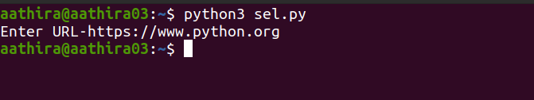
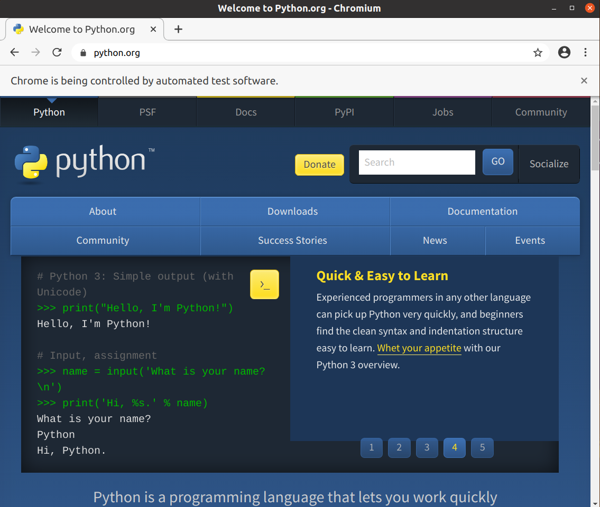

<h4>Requirements</h4>
<ol>
<li>Install Selenium - pip install selenium
<li>Install BeautifulSoup-pip install bs4
<li>Install chrome driver from 
https://sites.google.com/a/chromium.org/chromedriver/downloads and place it in systems path.
Path can be set by export PATH="$PATH:/path/to/chromedriver"
</ol>

 Run the program on command line .This will start the instance chrome.

 
 Enter any url whose data to be parsed

The html page of the entered url is opened on the browser. Now we can perform any kind of parsing.

